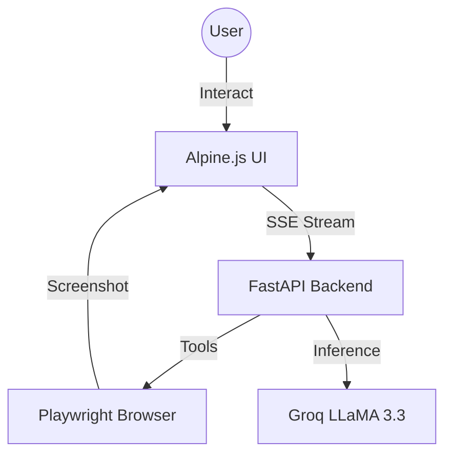

<p align="center">
  
  
  
  
  
</p>

# 🤖 broAI — The Lightweight AI Agent Workspace

> **The most lightweight way to run an autonomous browser agent. No npm, no Vite, no build steps.**

**broAI** is a high-performance AI agent workspace that turns natural language instructions into real-world browser actions. It features a premium, Claude-style split-screen interface powered by **Alpine.js** and **FastAPI**.

---

## ✨ Key Features

| Feature | Description |
|---|---|
| 🪶 **Zero-Build Frontend** | Pure Alpine.js + Tailwind CDN. No `node_modules`, no `npm install` for UI. |
| 🖥️ **Split-Screen Workspace** | Watch the agent work in a live browser preview (left) while it reasons in the chat (right). |
| 🧠 **Autonomous Agent** | Powered by Groq LLaMA 3.3. It plans, navigates, and executes complex tasks independently. |
| 🛡️ **Ask Before Acting** | Built-in safety toggle to confirm risky actions (purchases, deletes) before they happen. |
| 📡 **Real-Time Streaming** | Every thought and action is streamed live via Server-Sent Events (SSE). |
| 📸 **Live Snapshots** | Visual feedback with real-time base64 screenshots of the agent's browser state. |

---

## 🏗️ Architecture



---

## 📂 Project Structure

```
broAI/
├── backend/
│   ├── main.py          # FastAPI app & SSE streaming
│   ├── agent.py         # Agent reasoning loop
│   ├── browser_bridge.py # Playwright automation engine
│   ├── tools.py         # Browser tools & schemas
│   └── requirements.txt # Python dependencies
│
├── frontend/
│   ├── index.html       # Single-file Alpine.js Workspace
│   └── index_react.html # Legacy React backup
│
└── README.md
```

---

## 🚀 Getting Started

### 1 · Backend Setup
Ensure you have Python 3.10+ installed.

```bash
# Install dependencies
pip install -r backend/requirements.txt
playwright install chromium

# Set your API Key in backend/.env
GROQ_API_KEY=your_key_here
```

### 2 · Run the Workspace
Open **one terminal** to start the backend:

```bash
python backend/main.py
```

### 3 · Open the UI
Simply open `frontend/index.html` in your browser. 
**No local server or build step required.**

---

## 🧰 Available Browser Tools

| Tool | Purpose |
|---|---|
| `open_url` | Navigate to any website |
| `click` | Click buttons, links, or inputs |
| `type` | Fill out forms and search bars |
| `scroll` | Move up/down the page |
| `extract` | Scrape text content from specific areas |
| `get_page_state` | Observe the DOM and find interactive elements |
| `back / forward` | History navigation |

---

## 🛡️ Safety First

The workspace includes a **"Ask before acting"** toggle. When enabled, the agent will stop and request your permission before performing actions on high-risk keywords such as:
`purchase`, `buy`, `delete`, `remove`, `confirm order`, `submit`.

---

## 🔌 API Reference

### `POST /task`
Starts the agent loop.
**Payload:** `{ "task": "Find the weather in NYC", "max_steps": 20 }`

### `GET /snapshot`
Returns the current browser URL, visible elements, and a base64 screenshot.

---

## 🧪 Tech Stack

*   **Frontend**: Alpine.js, Tailwind CSS (CDN), Lucide Icons
*   **Backend**: Python, FastAPI, Playwright, Groq SDK
*   **Inference**: Groq (LLaMA 3.3 70B Versatile)

---

<p align="center">
  <sub>Built for speed and simplicity — <b>broAI</b></sub>
</p>